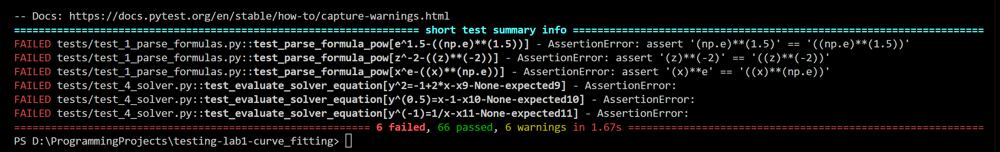

Работы выполнил: Стафеев Иван Алексееич (t.me/st_affeev)
Проект: https://github.com/staffeev/curve_fitting
Форк проекта с тестами: https://github.com/staffeev/testing-lab1-curve_fitting


### Анализ функциональности проекта

Этот небольшой проект `curve_fitting` был написан мной как заказ на фрилансе. У заказчика были исходные данные в виде набор точек и список 2D-функций с параметрами, для каждой функции надо такие параметры, чтобы получившаяся кривая наилучшим образом приблажалась к заданным точкам. После выполнения заказчик обратился вновь для расширения функционала на 3D-функции, где мне необходимо было написать интеграционные тесты, из-за чего сейчас я и выбрал этот проект для написания юнит-тестов.

Функционал программы разбит на блоки по файлам:

- `build_objectives.py`. Здесь находятся одни из самых важных функций проекта, без корректной работы которых невозможна дальнейшая работа. Функция `parse_formula` принимает в себя строку-формулу (например, `z=(A+Cx+Elny+Gx^2+I(lny)^2+Kxlny)/(1+Bx+Dlny+Fx^2+H(lny)^2+Jxlny)`) и возвращает формулу в виде, воспринимаемом python'ом (через `eval`), количество переменных и константы. В процесее выполнения функции исходная строк прогоняется через ряд правил, записанных регулярными выражениями, для преобразоания. Фукнция `parse_source` принимает в себя массив строк-формул и каждую спарсенную формулу заносит в файл `pbjectives.py` как словарь вида `{'form': 'z=A+Bx^2+Cy', 'fun': lambda xy, A, B, C: A+B*(xy[0])**(2)+C*(xy[1]), 'typ': 'simple', 'dim': 3, 'params': ('A', 'B', 'C')}`. Здесь необходимо проверять корректное опредление типа функции и работоспособность лямбд.

- `curve_fitting.py`. Файл, где происходит само приближение кривой по точкам. Функция `round_to_len` необходима для округления числа до точного количества знаков / разрядов (ее проверить необходимо). Функция `replace_constant_placeholders_with_numbers` нужна для замены в формуле букв констант на найденные числовые значены параметров (проверить необходимо). В функции `metrics_calc` происходит расчет метрик $R^2$, adjusted $R^2$, std_error, max_error и F_stat (проверять необходимо). Функции `process_function` и `find_fit_and_metrics` в совокупности для набора строк-функций подбирают оптимальные значения параметров и считают для них метрики, сохраняя в массив. Внутри функций используются же написанные ранее функции, так что тестирование этих функций энит-тестами не требуется (это должны быть интеграционные тесты).

- `solver.py`. Здесь две функции - `get_solutions`, которая для набора точек находит оптимальные (по $R^2$ и max_err) кривые с подобранными параметрами и сохраняет их в файл (юнит-тесты здесь не нужны, только интеграционные); и `evaluate_solver_equation`, которая для функции с подобранными параметрами считает значения этой функции в переданных точках (тестирование требуется). 

### Написание тестов

#### 1. Парсинг формул (`test_1_parse_formulas.py`)

Эту часть функционала нужно проверить тщательнее всего, так как в ней используются не самые простые для понимания регулряные выражения в большом количестве, а также, поскольку парсинг запускается один раз (пока нет необходимости парсить новые формулы), найти ошибку сложнее.

Суть функции `parse_formula` в том, чтобы сделать из строки `y^(-1)=A+B/x^(0.5)+Clnx/x^2` такую строку - `(y)**((-1))=A+B/(x)**((0.5))+C*(np.log(x))/(x)**(2)`. Для этого используются следующие регулярные выражения и замены (используются в `re.sub`): 

```python
REPLACE_EXP = r"(\g<0>)"   # обернуть выражение в скобки

RULES = {
    r"-?[xyz]": REPLACE_EXP,                  # переменная
    r"-?([0-9]+)\.?([0-9]*)": REPLACE_EXP,    # конкретное число
    r"[eyxz]\^\(+-?\w+\)+": REPLACE_EXP,      # переменная в числовой степени или exp
    r"e\^": r"(np.e)^",                       # е в степени
    r"ln\(\w+\)": REPLACE_EXP,                # натуральный логарифм
    r"[+-=*/\^][A-Z]\(": r"\g<0>*",           # коэффициент в уравнении
    r"\(\*": r"*(",                           # изменение (* на *(
    r"ln": r"np.log",                         # натуральный логарифм заменяется на log, чтобы numpy мог посчитать
    r"\)\(": r")*(",                          # умножение после степени
    r"\^": r"**"                              # знак степени
}
```

и каждую замену хорошо бы проверить, кроме самых очевидных, типа `r"\^": r"**" `.

Было написано 6 тестов, проверяющих отдельные наиболее критически важные замены:

1. Проверка определения переменных x, y, z. Проверка происходит по количеству определенных функцией переменных.

```python
@pytest.mark.parametrize("formula,expected_vars", [
    ("x", 1),
    ("-x", 1),
    ("xy", 2),
    ("xxyzzzyxyzy", 3),
    ("aaa", 0),
    ("", 0),
])
def test_parse_formula_variables(formula, expected_vars):
    _, num_vars, _ = parse_formula(formula)
    assert num_vars == expected_vars
```

2. Проверка определения числовых коэффициентов и оборачивание их в скобки.

```python
@pytest.mark.parametrize("formula,expected_parsed", [
    ("5", "(5)"),
    ("-2.5", "(-2.5)"),
    ("^-1.5", "**(-1.5)"),
    ("", ""),
    ("(3.5)", "((3.5))"),
])
def test_parse_formula_digits(formula, expected_parsed):
    parsed, _, _ = parse_formula(formula)
    assert parsed == expected_parsed
```

3. Проверка переменной в степени и экспоненты.

```python
@pytest.mark.parametrize("formula,expected_parsed", [
    ("e^x", "((np.e)**(x))"),
    ("e^1.5", "((np.e)**(1.5))"),
    ("e^2", "((np.e)**(2))"),
    ("z^-2", "((z)**(-2))"),
    ("x^(1)y^2.5x^-2", "(x)**((1))*(y)**(2.5)*(x)**(-2)"),
    ("x^e", "((x)**(np.e))")
])
def test_parse_formula_pow(formula, expected_parsed):
    parsed, _, _ = parse_formula(formula)
    assert parsed == expected_parsed
```

4. Проверка определения логарифма.

```python
@pytest.mark.parametrize("formula,expected_parsed", [
    ("lnx", "(np.log(x))"),
    ("ln2.5", "np.log(2.5)"),
    ("xlny", "(x)*(np.log(y))"),
    ("lnxy", "(np.log(x))*(y)")
])
def test_parse_formula_log(formula, expected_parsed):
    parsed, _, _ = parse_formula(formula)
    assert parsed == expected_parsed
```

5. Проверка скобок.

```python
@pytest.mark.parametrize("formula,expected_parsed", [
    (")(", ")*("),
    ("((()))", "((()))"),
    (")()()()()", ")*()*()*()*()"),
    (")()(())", ")*()*(())"),
    ("(*", "*("),
    ("(*()*(", "*(()*(")
])
def test_parse_formula_braces(formula, expected_parsed):
    parsed, _, _ = parse_formula(formula)
    assert parsed == expected_parsed
```

6. Проверка определения параметров

```python
@pytest.mark.parametrize("formula,expected_constants", [
    ("A", ["A"]),
    ("Ax+By", ["A", "B"]),
    ("CDZ", ["C", "D", "Z"]),
    ("aAbB", ["A", "B"]),
    ("", []),
    ("A+A*A+AAA", ["A"]) 
])
def test_parse_formula_constants(formula, expected_constants):
    _, _, constants = parse_formula(formula)
    assert constants == expected_constants
```

#### 2. Сборка формул в файл (`test_2_build_objectives.py`)

Следующим логическим этапом работы программы идет запись всех спарсенных формул в файл в определенном формате, чтобы из файла эти формулы можно было потом достать и сразу передавать в `scipy.curve_fitting`.

Тест выглядит следующим образом:

```python
def test_parse_source_mock_open():
    formulas = [
        # 3D
        "z^(-1)=A+Bx^2lnx+Cylny",
        "lnz=A+Bx^(2.5)+Cy/lny",
        "z=(A+Blnx+C(lnx)^2+Dy+Ey^2)/(1+Flnx+Gy)",
        # 2D
        "lny=A+B/x^(1.5)+Clnx/x^2",
        "y^(-1)=A+B/x^(0.5)+Clnx/x^2",
        "y^2=A+Bx^(0.5)lnx",
        "y^(0.5)=A+Bx+Cx^2+Dx^3",
        "y=A+Bx+Cx^(0.5)lnx+Dx^(0.5)"
    ]

    expected_objectives = [
        # 3D
        {'form': 'z^(-1)=A+Bx^2lnx+Cylny', 'fun': lambda xy, A, B, C: A+B*(xy[0])**(2)*(np.log(xy[0]))+C*(xy[1])*(np.log(xy[1])), 'typ': 'inv', 'dim': 3, 'params': ('A', 'B', 'C')},
        {'form': 'lnz=A+Bx^(2.5)+Cy/lny', 'fun': lambda xy, A, B, C: A+B*(xy[0])**((2.5))+C*(xy[1])/(np.log(xy[1])), 'typ': 'ln', 'dim': 3, 'params': ('A', 'B', 'C')},
        {'form': 'z=(A+Blnx+C(lnx)^2+Dy+Ey^2)/(1+Flnx+Gy)', 'fun': lambda xy, A, B, C, D, E, F, G: (A+B*(np.log(xy[0]))+C*((np.log(xy[0])))**(2)+D*(xy[1])+E*(xy[1])**(2))/((1)+F*(np.log(xy[0]))+G*(xy[1])), 'typ': 'simple', 'dim': 3, 'params': ('A', 'B', 'C', 'D', 'E', 'F', 'G')},
        # 2D
        {'form': 'lny=A+B/x^(1.5)+Clnx/x^2', 'fun': lambda x, A, B, C: A+B/(x)**((1.5))+C*(np.log(x))/(x)**(2), 'typ': 'ln', 'dim': 2, 'params': ('A', 'B', 'C')},
        {'form': 'y^(-1)=A+B/x^(0.5)+Clnx/x^2', 'fun': lambda x, A, B, C: A+B/(x)**((0.5))+C*(np.log(x))/(x)**(2), 'typ': 'inv', 'dim': 2, 'params': ('A', 'B', 'C')},
        {'form': 'y^2=A+Bx^(0.5)lnx', 'fun': lambda x, A, B: A+B*(x)**((0.5))*(np.log(x)), 'typ': 'square', 'dim': 2, 'params': ('A', 'B')},
        {'form': 'y^(0.5)=A+Bx+Cx^2+Dx^3', 'fun': lambda x, A, B, C, D: A+B*(x)+C*(x)**(2)+D*(x)**(3), 'typ': 'sqrt', 'dim': 2, 'params': ('A', 'B', 'C', 'D')},
        {'form': 'y=A+Bx+Cx^(0.5)lnx+Dx^(0.5)', 'fun': lambda x, A, B, C, D: A+B*(x)+C*(x)**((0.5))*(np.log(x))+D*(x)**((0.5)), 'typ': 'simple', 'dim': 2, 'params': ('A', 'B', 'C', 'D')},
    ]

    m = mock_open()
    with patch("builtins.open", m):
        parse_source(formulas)
    m.assert_called_once()
    handle = m()
    objectives = [i.args[0].strip() for i in handle.write.call_args_list if "form" in i.args[0]]
    for expected_objective, objective_str in zip(expected_objectives, objectives):
        objective = eval(objective_str, {"np": np})[0]
        assert expected_objective["form"] == objective["form"]
        assert expected_objective["typ"] == objective["typ"]
        assert expected_objective["dim"] == objective["dim"]
        assert expected_objective["params"] == objective["params"]
        assert dis.dis(expected_objective["fun"]) == dis.dis(objective["fun"])
```

Вначале задаются формулы для теста (все 3 типа 3D-функций и все 5 типов 2D-функций), затем готовые objectives в том формате, в каком они должны быть в файле. Для имитации записи в файл ипользуется мок из `unittest.mock`. Собранный слоаврьт для функци assert'ится с ожидаемым результатом по форме записи (строка), типу функции (строка) (из типов есть inv, ln, sqrt, square и simple), количеству измерений (число), параметрам (кортеж строк) и лямбдам-функциям, которые впоследствии будут передаваться в функцию для аппроксимации кривой по точкам. Для сравнения лямбд ииспользуются библиотека `dis` для сравнения их байткода.

#### 3. Функции, участвующие в нахождении решения для набора точек (`test_3_curve_fitting.py`)

Здесь проверяются вспомогательные функции - для округления и замены параметров на числа -, а также функция для расчета метрик. Функции для непосредственно аппроксимации кривой по точкам не тестируются, так как являются объединениями других функций, соответственно, для них необходимы интеграционные, а не юнит-тесты (плюс главная функция для самой аппроксимации готовая и взята из библиотеки `scipy` и тестировать ее нет смысла)

1. Округление числа до указанного числа знаков / разрядов. Здесь учитываются отдельные случаи `np.nan` и `np.inf`

```python
@pytest.mark.parametrize("value,digits,expected_value", [
    (4.5, 4, 4.5),
    (0, 4, 0),
    (123.0, 4, np.int64(123)),
    (-100.0, 3, np.int64(-100)),
    (12345.6789, 4, 12350.0),
    (987654321, 5, np.int64(987650000)),
    (0.000987654, 2, 0.00099),
    (-0.00012345, 3, -0.000123),
    (np.inf, 4, np.inf),
    (-np.inf, 4, -np.inf),
    (np.nan, 4, np.nan),
])
def test_round_to_len(value, digits, expected_value):
    rounded_value = round_to_len(value, digits=digits)

    if np.isnan(expected_value):
        assert np.isnan(rounded_value)
    else:
        assert rounded_value == expected_value
```

2. Замены параметров на их численные значения

```python
@pytest.mark.parametrize("formula,letters,numbers,expected", [
    ("a+1", ["a"], [5], "5+1"),
    ("a+b", ["a", "b"], [2, 3], "2+3"),
    ("x+y", [], [], "x+y"),
    ("a+b", ["a", "b"], [3, -4], "3-4"),
    ("a+a*a", ["a"], [7], "7+7*7"),
    ("a-b", ["a", "b"], [-2, 5], "-2-5"),
    ("a+b", ["a", "b"], [1.5, 2.75], "1.5+2.75"),
    ("", [], [], "")
])
def test_replace_constant_placeholders_with_numbers(formula, letters, numbers, expected):
    result = replace_constant_placeholders_with_numbers(formula, letters, numbers)
    assert result == expected
```

3.1. Проверка подсчета метрик.

```python
@pytest.mark.parametrize(
    "x_data, func, true_params, fit_params, noise_std, expect_r2_min",
    [
        (np.linspace(0, 10, 50), lambda x, a, b: a * x + b, (2, 1), (2.01, 0.95), 0.1, 0.98),
        (np.linspace(-5, 5, 60), lambda x, a, b, c: a * x**2 + b * x + c, (1.5, -0.5, 2), (1.45, -0.55, 2.1), 1.0, 0.9),
        (np.linspace(0.1, 10, 40), lambda x, a, b: a * np.sqrt(x) + b, (3, 2), (3.1, 1.9), 0.5, 0.85),
        (np.linspace(0.1, 10, 50), lambda x, a, b: a * np.log(x) + b, (4, 5), (3.9, 5.2), 0.3, 0.8),
        (np.linspace(1, 10, 50), lambda x, a, b: a / x + b, (10, 0.5), (9.8, 0.7), 0.1, 0.9),
    ],
)
def test_metrics_calc_common_functions(x_data, func, true_params, fit_params, noise_std, expect_r2_min):
    rng = np.random.default_rng(42)
    y_true = func(x_data, *true_params)
    y_noisy = y_true + rng.normal(0, noise_std, len(x_data))
    y_pred = func(x_data, *fit_params)

    r2, adj_r2, std_err, max_err, f = metrics_calc(x_data, y_noisy, y_pred, func)

    assert np.isfinite(r2)
    assert np.isfinite(adj_r2)
    assert np.isfinite(std_err)
    assert np.isfinite(max_err)
    assert np.isfinite(f)
    assert 0 <= r2 <= 1
    assert adj_r2 <= 1
    assert f >= 0
    assert r2 > expect_r2_min
```

Здесь берется по одной функции каждого типа, вычисляются истинные значения `y`, к ним добавляется шум, вычисляются значения `y_pred` по предсказанным параметрам, затем вычисляются сами метрики. Проверятся, что: 1) они все являются числами; 2) $R^2$ лежит в диапазоне [0, 1]; 3) adjusted $R^2\le 1$; 4) F-статистика $\ge0$ и 5) посчитанная $R^2$ больше порогового значения (оно вычисляется эмпирически).


3.2 Для подсчет метрик были взяты и граничные случаи - совпадение `y` и `y_pred`, контантные значения `y` и случайные данные, где не должно быть корелляции.

```python
@pytest.mark.parametrize(
    "description, x_data, y_data, y_pred, func, expected_behavior",
    [
        # одинаковые y и y_pred
        ("perfect_fit", np.arange(10), np.arange(10) * 2, np.arange(10) * 2, lambda x, a, b: a * x + b, lambda r2, *_: np.isclose(r2, 1)),
        # случайные данные, не должно быть зависимости
        ("no_relation", np.arange(10), np.random.random(10), np.random.random(10), lambda x, a, b: a * x + b, lambda r2, *_: r2 < 0.3),
        # константные y и y_pred
        ("constant_y", np.arange(10), np.ones(10) * 5, np.ones(10) * 5, lambda x, a, b: a * x + b, lambda r2, *_: np.isnan(r2) or np.isinf(r2)),
    ],
)
def test_metrics_calc_edge_cases(description, x_data, y_data, y_pred, func, expected_behavior):
    try:
        r2, adj_r2, std_err, max_err, f = metrics_calc(x_data, y_data, y_pred, func)
    except Exception as e:
        pytest.skip(f"{description} вызвал исключение: {e}")

    assert expected_behavior(r2, adj_r2, std_err, max_err, f), f"Неожиданное поведение для случая {description}"
```

#### 4. Нахождение значений функции с подобранными параметрами

Здесь проверяется функция `evaluate_solver_equation`, которая для функции с подобранными параметрами считает значения этой функции в переданных точках. Проверяется по одной функции каждого типа для 2D и 3D с учетом граничных случаев (некорректные аргументы, например, `x<=0` для `lnx`). Значения функций сравниваются с точностью до `10^(-6)`.

```python
@pytest.mark.parametrize(
    "equation,x,y,expected",
    [
        # 3д
        ("z^(-1)=1+2*x**2*np.log(x)+3*y*np.log(y)",
         np.array([1,2,3]), np.array([1,2,3]),
         [(1,1,1/(1+2*1**2*np.log(1)+3*1*np.log(1))),
          (2,2,1/(1+2*2**2*np.log(2)+3*2*np.log(2))),
          (3,3,1/(1+2*3**2*np.log(3)+3*3*np.log(3)))]
        ),
        ("lnz=1+2*x**2.5+3*y/np.log(y)",
         np.array([1,2,3]), np.array([2,3,4]),
         [(1,2,np.exp(1+2*1**2.5+3*2/np.log(2))),
          (2,3,np.exp(1+2*2**2.5+3*3/np.log(3))),
          (3,4,np.exp(1+2*3**2.5+3*4/np.log(4)))]
        ),
        ("z=(1+2*np.log(x)+3*(np.log(x))**2+4*y+5*y**2)/(1+6*np.log(x)+7*y)",
         np.array([1,2]), np.array([1,2]),
         [(1,1,(1+2*np.log(1)+3*np.log(1)**2+4*1+5*1**2)/(1+6*np.log(1)+7*1)),
          (2,2,(1+2*np.log(2)+3*np.log(2)**2+4*2+5*2**2)/(1+6*np.log(2)+7*2))]
        ),
        # 2д
        ("lny=1+2/x**1.5+3*np.log(x)/x**2",
         np.array([1,2,4]), None,
         [(1,np.exp(1+2/1**1.5+3*np.log(1)/1**2)),
          (2,np.exp(1+2/2**1.5+3*np.log(2)/2**2)),
          (4,np.exp(1+2/4**1.5+3*np.log(4)/4**2))]
        ),
        ("y^(-1)=1+2/x**0.5+3*np.log(x)/x**2",
         np.array([1,2,4]), None,
         [(1,1/(1+2/1**0.5+3*np.log(1)/1**2)),
          (2,1/(1+2/2**0.5+3*np.log(2)/2**2)),
          (4,1/(1+2/4**0.5+3*np.log(4)/4**2))]
        ),
        ("y^2=1+2*x**0.5*np.log(x)",
         np.array([1,4]), None,
         [(1,np.sqrt(1+2*1**0.5*np.log(1))),
          (4,np.sqrt(1+2*4**0.5*np.log(4)))]
        ),
        ("y^(0.5)=1+2*x+3*x**2+4*x**3",
         np.array([0.5,1]), None,
         [(0.5,(1+2*0.5+3*0.5**2+4*0.5**3)**2),
          (1,(1+2*1+3*1**2+4*1**3)**2)]
        ),
        ("y=1+2*x+3*x**0.5*np.log(x)+4*x**0.5",
         np.array([1,4]), None,
         [(1,1+2*1+3*1**0.5*np.log(1)+4*1**0.5),
          (4,1+2*4+3*4**0.5*np.log(4)+4*4**0.5)]
        ),
        # граничные случаи
        ("lny=1+np.log(x)",
         np.array([-1,0,1,2]), None,
         [  (-1, np.nan),
            (0,np.exp(1+np.log(0))),
            (1,np.exp(1+np.log(1))),
            (2,np.exp(1+np.log(2)))]
        ),
        ("y^2=-1+2*x",
         np.array([0,0.5,1]), None,
         [(1,np.sqrt(-1+2*1))]
        ),
        ("y^(0.5)=x-1",
         np.array([0,0.5,1,2]), None,
         [(1,np.sqrt(1-1)),
          (2,np.sqrt(2-1))]
        ),
        ("y^(-1)=1/x",
         np.array([-1,0,1,2]), None,
         [(1,1/1),
          (2,1/2)]
        ),
    ]
)
def test_evaluate_solver_equation(equation, x, y, expected):
    res = evaluate_solver_equation({}, equation, x, y)
    npt.assert_allclose(res, expected, atol=1e-6)
```

### Запуск и проверка, исправление ошибок

Для автоматизации был написан [action](https://github.com/staffeev/testing-lab1-curve_fitting/blob/main/.github/workflows/testing.yml), который при пуше в ветку вызывает запуск тестов через `pytest -v --tb=short --cov=./source`.

Тесты писались последовательно (в том порядке, в котором указаны в отчете), и в них уже присутсоввали тесты, которые не прошли, но исправление соответствующих ошибок в коде было оставлено на потом.

Результат запуска тестов:



6 тестов из 72 выполнились с ошибкой, три из них относятся к парсингу формул (конкретно к определению степеней), три - к вычислению значений функции с подобранными параметрами.

#### 1. Исправление ошибки со степенями

Следующие тесты завершились с ошибкой:
```python
FAILED tests/test_1_parse_formulas.py::test_parse_formula_pow[e^1.5-((np.e)**(1.5))] - AssertionError: assert '(np.e)**(1.5)' == '((np.e)**(1.5))'
FAILED tests/test_1_parse_formulas.py::test_parse_formula_pow[z^-2-((z)**(-2))] - AssertionError: assert '(z)**(-2)' == '((z)**(-2))'
FAILED tests/test_1_parse_formulas.py::test_parse_formula_pow[x^e-((x)**(np.e))] - AssertionError: assert '(x)**e' == '((x)**(np.e))'
```

Регулярное выражение, отвечающее за работу со степенями, такое: `[eyxz]\^\(+-?\w+\)+`. Оно не учитывает случаи `e^2` (нет скобок у показателя степени), `e^(1.5)` (дробная степерь, т.к. `\w` заменяет числа, буквы и занк нижнего подчеркивания, но не точку), из-за этого выражение со степнью не оборачивается в скобки, а также `e` в коде может считаться только основанием степени, но не показателем. Также было выявлено, что выражение `[eyxz]\^\(+-?\w+\)+` не учитывает скобки у переменной, а оин всегда у нее есть, т.к. правило на выяление переменной и заключение ее в скобки идет самым первым. 

Было решено убрать это правило вообще и соответствущие тесты, так как заключение выражения в скобки не имеет смысла с точки зрения порядка математических операций (эта степень все равно выполнится раньше), а с учетом структуры формул во входных данных невозможны формулы, где в показателе степени будут сложные выражения, типа `y^(x/z)`.


### Исправление ошибок


### Анализ написанных тестов